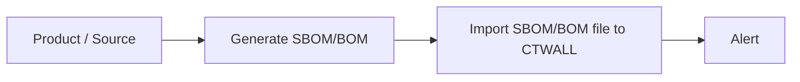

# CTWall - ChainThreatWall

<table>
    <tr styl="margin: 0; position: absolute; top: 50%; -ms-transform: translateY(-50%); transform: translateY(-50%);">
        <th>
            

                <a href="https://github.com/CyberGabiSoft/CTWall/releases/latest">GitHub release</a>
            

        </th>
    </tr>
 </table>

As more teams move to virtualized development environments to reduce software supply-chain risk, one challenge remains: malicious dependencies can still slip through and reach production.

**CTWall (ChainThreatWall)** platform helps Security, DevOps, and Product teams make risk decisions faster by using SBOM/BOM data to identify malware in the software supply chain. This tool is a practical supplement to classic SCA (Software Composition Analysis): it adds malware-focused detection in the software supply chain layer. By using free/public threat intelligence sources (for now it is only publicly available OSV database from https://osv.dev/), teams can generate notifications about newly observed dependency threats without building a custom intel pipeline from scratch.

SBOMs can be easily imported into the platform using [DepAlert](https://github.com/CyberGabiSoft/DepAlert).

## Quick start
See [00_quick_start.md](./docs/00_quick_start.md) for step-by-step instructions.

## Platform purpose

From a business perspective, tool helps You to:
<ul>
<li> Get dependency malware risk visibility in one place. </li>
<li> React faster to malware threats. </li>
<li> Keep history and evidence for audits. </li>
<li> Reduce manual triage effort. </li>
</ul>

From an operational perspective, CTWall platform delivers useful functionality to:
<ul>
<li>Ingest SBOMs from CI/CD and vendor channels.</li>
<li>Keep revision history for each Product / Scope / Test.</li>
<li>Map components to malware intelligence and triage findings.</li>
<li>Monitor posture and trends on project dashboards.</li>
<li>Dispatch operational alerts to connectors (Jira, SMTP, Slack, SNS, external Alertmanager).</li>
</ul>

 

  
  
  

## What happens in runtime

Application flow:
<ol>
<li>SBOM is uploaded (or sent by agent).</li>
<li>Revision and components are persisted.</li>
<li>Background workers perform malware analysis.</li>
<li>Alert groups/occurrences are updated.</li>
<li>Configured connectors receive FIRING/RESOLVED signals.</li>
<li>UI presents dashboards, posture, explorer, and triage state.</li>
</ol>
 
 

 
 

## Cybersecurity problems that CTWall solves

1. **No continuous dependency risk monitoring (application + infrastructure).**
CTWall collects SBOM/BOM data and organizes it in one model: Product -> Scope -> Test. In today's threat landscape, lack of continuous monitoring and delayed response to dependency threats can lead to compromise of both applications and infrastructure.

2. **Late threat detection and reaction.**
SBOM import and analysis help detect risk before production or early in the delivery cycle. In practice, CTWall supports earlier detection of malware packages across both application dependencies and infrastructure-related dependencies.

3. **Fragmented alerts and communication noise.**
CTWall normalizes alerts and can send them to operational tools (for example Jira, Slack, SMTP, Alertmanager), instead of relying only on CI logs.

4. **Hard audits and missing decision history.**
The platform stores SBOM revision history and events, making it easier to audit and reconstruct what changed and when.

5. **Too much manual triage.**
Teams get structured results and can move faster from alert to decision.

## Some Attack Examples CTWall Can Help You Detect

CTWall helps by correlating SBOM/BOM components with threat intelligence and malware advisories, then generating operational alerts.

1. **March 2026 npm supply-chain compromise of Axios (axios, MAL-2026-2307).** 
Compromised maintainer credentials led to malicious axios releases (1.14.1, 0.30.4) that introduced the trojanized dependency plain-crypto-js@4.2.1; 
public advisories describe a postinstall-triggered cross-platform RAT/dropper and recommend treating exposed systems as compromised, with immediate secret and credential rotation.

2. **September 2025 npm supply chain campaign (Shai-Hulud + cryptojacking payloads).**
Phishing-led maintainer compromise, malicious package updates, credential/token theft, and CI/CD persistence were publicly documented in sector advisories.

3. **July 2025 PyPI phishing incident with malicious `num2words` releases (0.5.15, 0.5.16).**
Compromised maintainer account led to malicious package versions being published and later removed.

4. **November 2025 PyPI typosquatting campaign (`tableate`, MAL-2025-191535).**
Public OSV records describe RAT-like behavior and second-stage payload delivery.

5. **March 2026 PyPI malware case (`amigapythonupdater`, MAL-2026-1136).**
Public OSV records describe exfiltration of environment variables/cloud tokens and command execution behavior.

6. **February 2026 npm malware case (`test-npm-style`, MAL-2026-771).**
Public OSV/GHSA-linked records classify affected versions as malicious and recommend immediate secret rotation.

 
 

## Security
Please see 

## License
CTWall is licensed under the BSD 3-Clause License

## Want to get in touch or have questions?
For questions, contact us at: cybergabisoft@gmail.com
